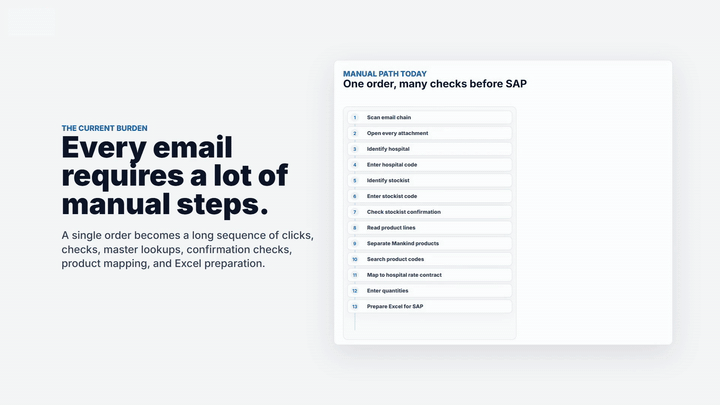
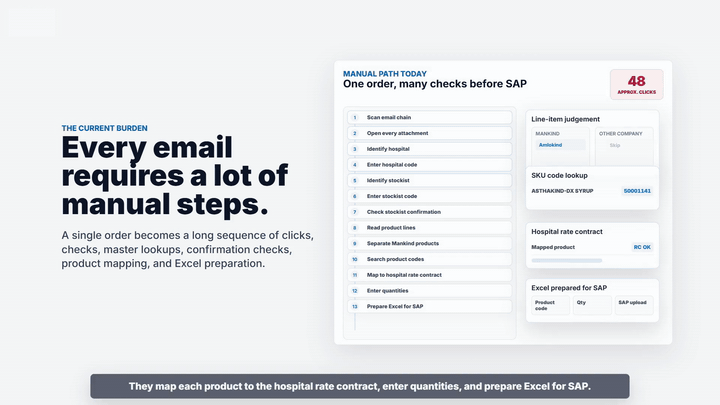

# SaaS Launch Video Playbook

This repository is a practical playbook for creating polished SaaS and internal-product launch videos using structured scripting, motion graphics, product screenshots, voiceover, subtitles, and iterative quality checks.

The example use case is a generic AI-assisted email order intake platform. The same workflow can be reused for dashboards, workflow automations, internal AI tools, enterprise portals, analytics products, or transformation programs.

## Preview The Output

These short GIFs show the type of motion system this playbook helps you plan, build, review, and package.

| Intake engine | Manual burden callouts |
| --- | --- |
|  |  |

| Three-step workflow | Product review focus |
| --- | --- |
|  |  |

## What This Repo Helps You Build

A 60-90 second launch video that explains:

- the business pain point
- the product workflow
- the role of AI
- the user journey
- the operational impact
- the final callout or product positioning

The goal is not only to make a video. The goal is to convert a business workflow into a clear product story.

## Example Narrative

The example video follows this arc:

1. Manual email-based order processing is slow and error-prone.
2. A new AI-assisted intake platform turns emails and attachments into review-ready drafts.
3. The user follows a three-step flow: select email, verify mappings, download Excel.
4. The result is fewer clicks, fewer product-code errors, faster preparation, and a clear audit trail.

All examples use synthetic names, mock data, and generic product references.

## Production Workflow

```mermaid
flowchart LR
  A["Business context"] --> B["Video brief"]
  B --> C["Script"]
  C --> D["Storyboard"]
  D --> E["Timestamp plan"]
  E --> F["HyperFrames composition"]
  F --> G["Voiceover"]
  G --> H["Whisper-style transcript and timing pass"]
  H --> I["Subtitle cue map"]
  I --> J["Render"]
  J --> K["Frame QA"]
  K --> L["Final video and short clips"]
```



## Tools Used

- AI-assisted planning and editing for story development, composition refinement, and QA iteration
- HyperFrames for HTML/CSS/GSAP-based motion graphics
- GSAP for animation sequencing
- FFmpeg and FFprobe for audio/video inspection, clipping, overlays, and final media checks
- Whisper-style transcription flow for transcript/timing review
- Subtitle cue map authored from transcript and manually aligned to scenes
- Product screenshots or short screen recordings as proof points

## Repository Contents

```text
.
|-- README.md
|-- CASE_STUDY.md
|-- prompts/
|   |-- 01_initial_video_brief.md
|   |-- 02_script_storyboard_prompt.md
|   |-- 03_hyperframes_build_prompt.md
|   |-- 04_revision_and_sync_prompt.md
|   `-- 05_final_qa_prompt.md
|-- storyboard/
|   |-- reference_script.md
|   `-- timestamp_plan.md
|-- docs/
|   |-- workflow_architecture.md
|   |-- production_pipeline.md
|   |-- anonymization_guide.md
|   |-- lessons_learned.md
|   `-- reusable_checklists.md
|-- examples/
|   |-- sample_input_brief.md
|   `-- sample_storyboard.md
|-- templates/
|   |-- video_brief_template.md
|   `-- voiceover_caption_pipeline.md
`-- media/
    |-- gifs/
    `-- snippets/
```

## How To Use This Playbook

1. Start with `templates/video_brief_template.md`.
2. Use the prompts in `prompts/` to generate and refine the script.
3. Convert the script into `storyboard/timestamp_plan.md`.
4. Build the video in HyperFrames or another motion system.
5. Add voiceover, run transcript/timing review, and create subtitles.
6. Render and run the QA checklist in `docs/reusable_checklists.md`.
7. Export short clips for internal demos, stakeholder updates, or portfolio use.

## What To Replace For Your Use Case

- product category
- pain points
- screenshots
- step names
- KPI language
- colors and branding
- voiceover
- subtitles

## Privacy Note

Do not publish real company logos, customer names, vendor names, internal screenshots, order IDs, email IDs, API keys, or confidential business data. Use the public release checklist before sharing externally.

Content and templates are provided for reuse under the repository license.

