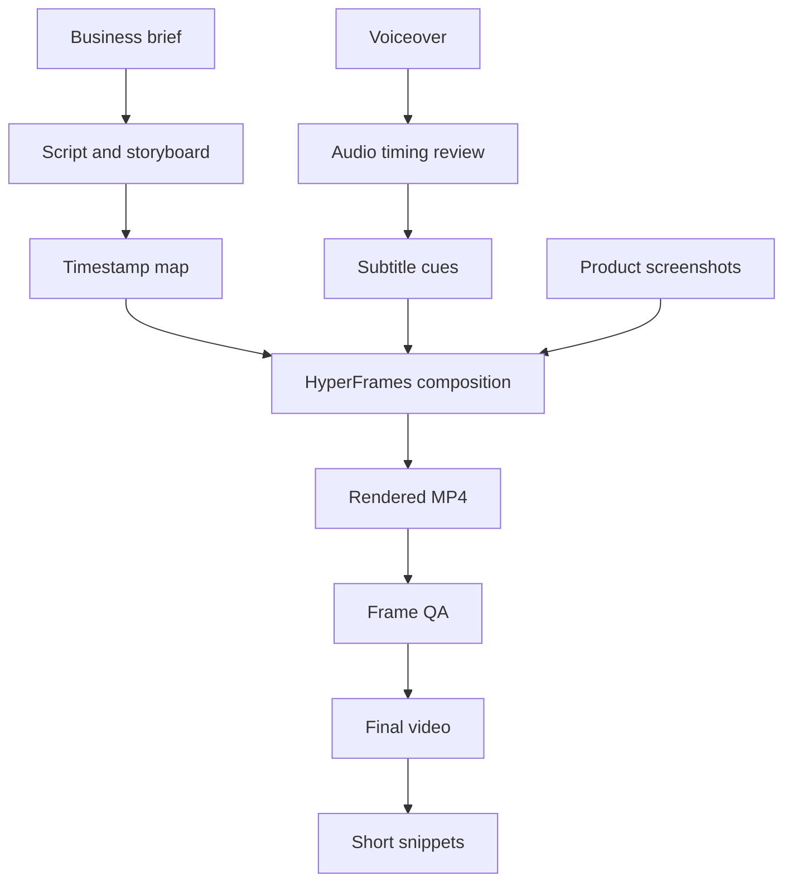

# Workflow Architecture

This project can be understood as a repeatable content-production architecture.

## Layers

### 1. Business Layer

Inputs:

- use case description
- current workflow pain points
- platform features
- target audience
- desired KPI message

Output:

- video brief

### 2. Story Layer

Inputs:

- video brief
- desired duration
- key scenes

Output:

- voiceover script
- storyboard
- timestamp plan

### 3. Motion Layer

Inputs:

- storyboard
- screenshots
- visual identity
- scene timings

Output:

- HyperFrames HTML composition
- CSS layout system
- GSAP timeline

### 4. Audio And Caption Layer

Inputs:

- voiceover MP3 or WAV
- final script

Process:

- inspect audio duration with FFprobe
- detect silence and rough phrase boundaries with FFmpeg
- create or review transcript using a Whisper-style transcription flow
- convert transcript into subtitle cues
- manually align cues to scene changes

Output:

- synced subtitles
- audio-linked scene timings

### 5. QA Layer

Inputs:

- rendered video
- expected storyboard

Checks:

- frame-level layout
- subtitle sync
- scene timing
- logo and confidential-data removal
- screen readability
- final video duration

Output:

- final MP4
- short clips
- release note

## Repeatable Architecture

